# 💓 AI-Powered Heart Disease Risk Prediction System (UCI)

---

## 📌 Project Overview

This project presents an **end-to-end Heart Disease Risk Prediction System** built using classical machine learning techniques and deployed as an interactive **Streamlit web application**. The model predicts the **probability of heart disease** based on patient clinical attributes such as age, cholesterol level, resting blood pressure, heart rate, and ECG results.

The system emphasizes:
- Clinical interpretability
- Robust preprocessing & EDA
- Transparent model evaluation
- Explainable AI using SHAP

**Dataset Source (UCI):**  
[Kaggle Dataset UCI](https://www.kaggle.com/datasets/redwankarimsony/heart-disease-data)

---

## 🧠 System Architecture

1. **Data Ingestion**
   - Loads UCI Heart Disease dataset
   - Handles numerical and categorical features

2. **Exploratory Data Analysis**
   - Histograms and boxplots
   - Correlation heatmap
   - Missing value analysis
   - Target distribution

3. **Preprocessing**
   - Encoding categorical features
   - Feature scaling
   - Pipeline-based transformations (no data leakage)

4. **Model Training**
   - Scikit-learn classifier
   - Optimized using ROC-AUC and F1-score

5. **Evaluation**
   - Confusion Matrix
   - ROC Curve
   - Precision-Recall Curve

6. **Explainability**
   - SHAP for global and local interpretability

7. **Deployment**
   - Streamlit app
   - Dockerized
   - Hosted on Hugging Face Spaces

---

## 🛠️ Technologies Used

- Python 3.9+
- Pandas, NumPy
- Scikit-learn
- Matplotlib, Seaborn
- SHAP
- Streamlit
- Joblib
- Docker

---

## 📊 Dataset Features

| Feature | Description |
|------|------------|
| age | Age of the patient |
| sex | Sex (Male/Female) |
| cp | Chest pain type |
| trestbps | Resting blood pressure |
| chol | Serum cholesterol |
| fbs | Fasting blood sugar |
| restecg | Resting ECG |
| thalch | Max heart rate |
| exang | Exercise induced angina |
| oldpeak | ST depression |
| slope | Slope of ST segment |
| ca | Major vessels count |
| thal | Thalassemia |
| target | Heart disease (0/1) |

---

## 📈 Exploratory Data Analysis

### Target Distribution  

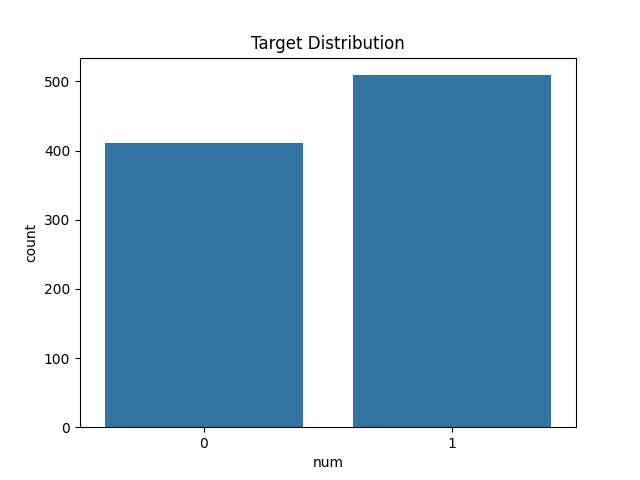

### Missing Values  

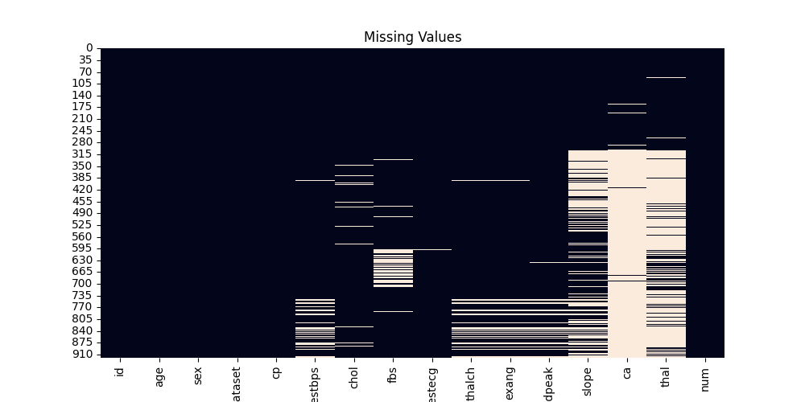

### Correlation Heatmap  

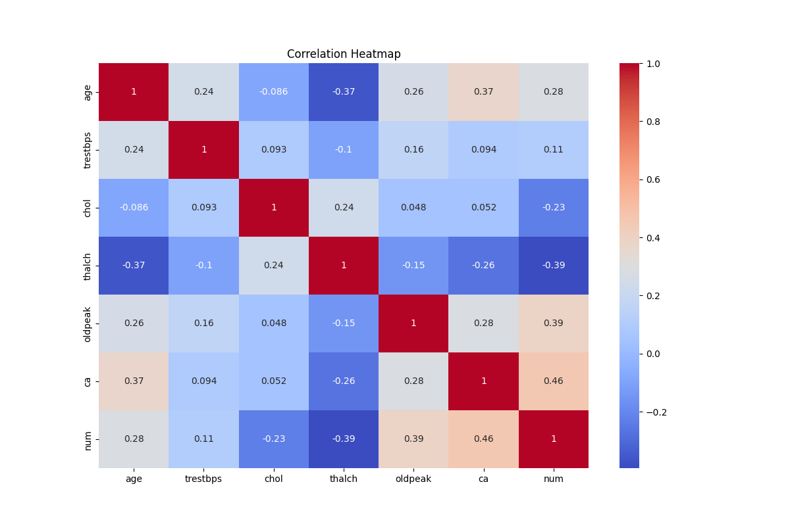

### Feature Distributions

**Age**  

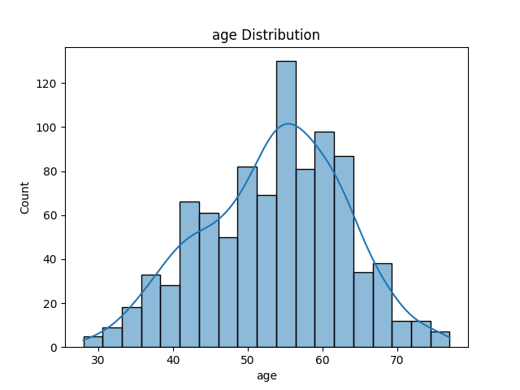  

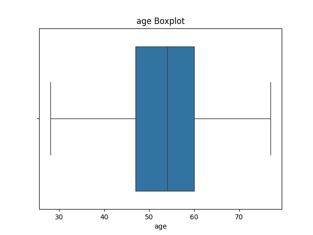

**Cholesterol**  

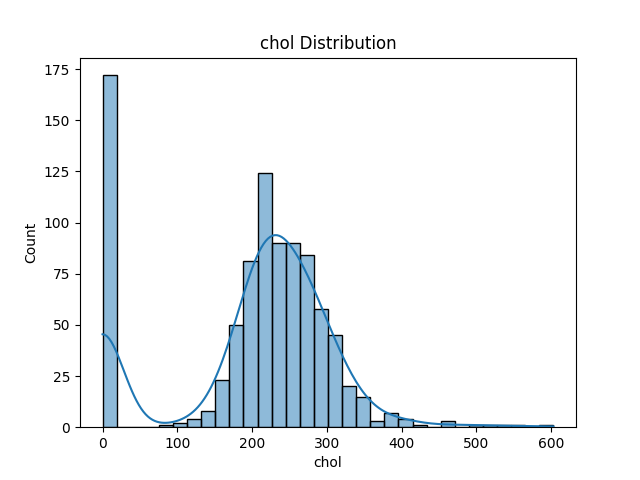  

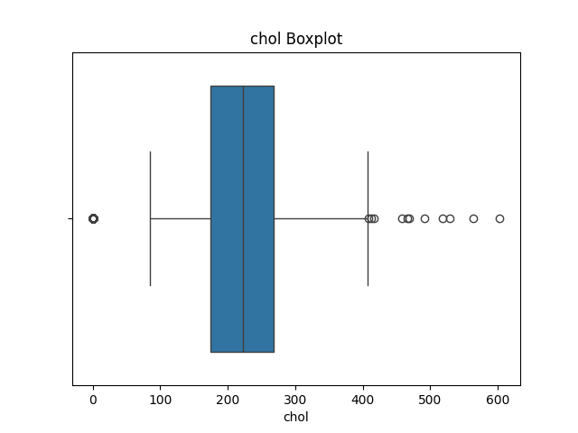

**Max Heart Rate (thalch)**  

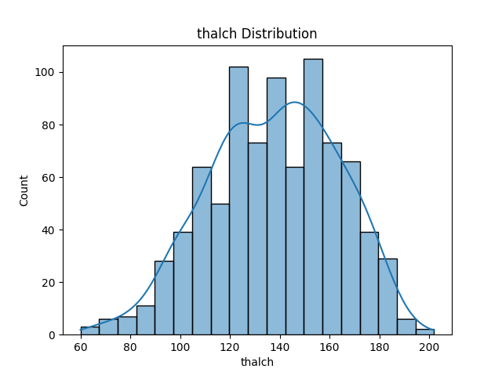  

  

**Resting Blood Pressure (trestbps)**  

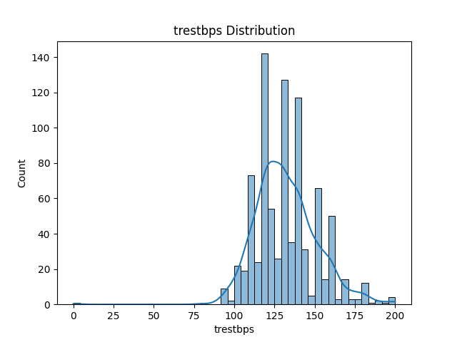  

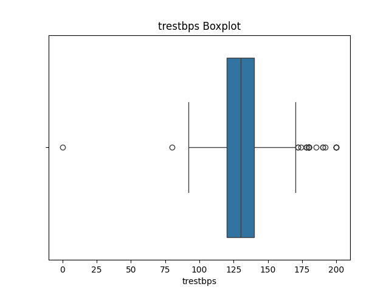  

**Oldpeak**  

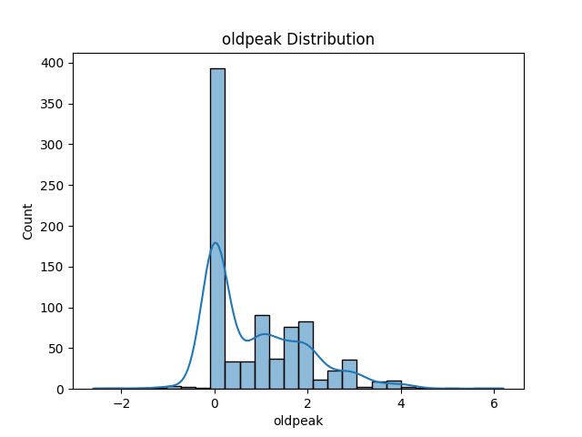  

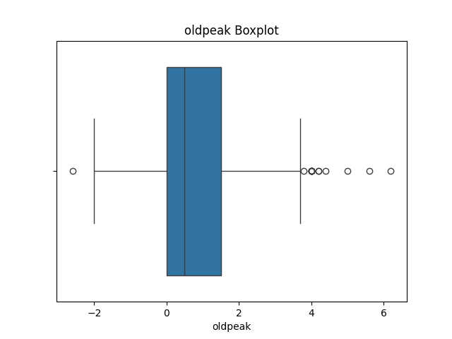  

**CA (Major Vessels)**  

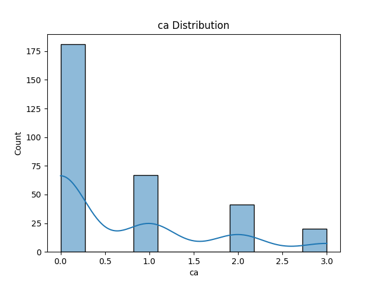  

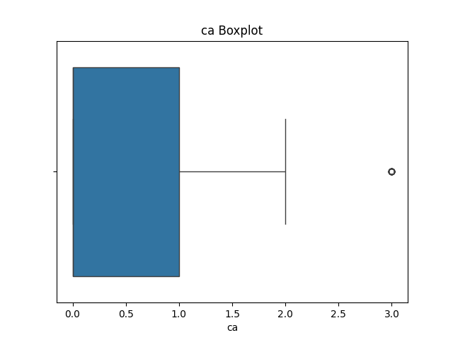  

---

## 📉 Model Evaluation

### Confusion Matrix  

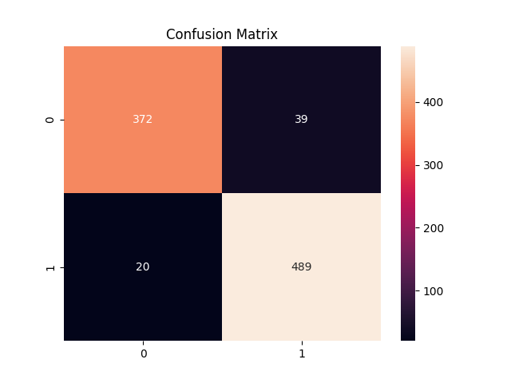

### ROC Curve  

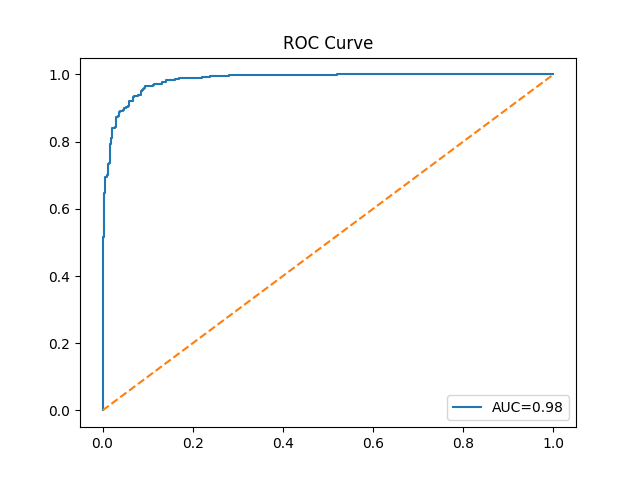

### Precision-Recall Curve  

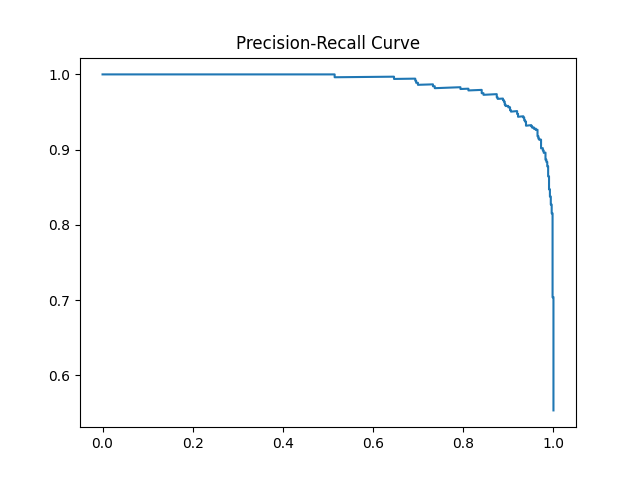

---

## 🚀 Live Application

**Hugging Face Spaces:**  
https://huggingface.co/spaces/gouthamkrishna404/Heart-Disease-Risk-Prediction-UCI
Currently down

